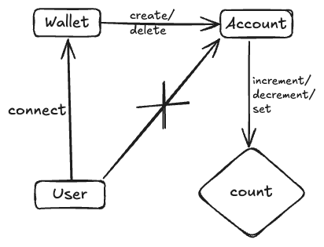

# Counter Program
Allows users to store a non-negative integer count on the blockchain and provides helpers to increment, decrement and set it to a particular number.
## User Stories
### Wallet Connection
- As a user, when I connect my wallet to the programe, I should be able to initialize a counter.
- As a user, when I connect my wallet to the programe, I should be able to close a counter.
- As a user, when I do not connect my wallet to the programme, I should not be able to initialize a counter

### Counter manipulation
- As a user, when I increment a counter, the count should incremented by 1.
- As a user, when I decrement a counter, the count should decremented by 1.
- As a user, when I reset a counter and enter a number, the count should be set to that number.

## Architectural Diagram

## Getting Started

### Install Dependencies

```shell
npm install
```

### anchor

This is a Solana program written in Rust using the Anchor framework.

#### Commands

You can use any normal anchor commands. Either move to the `anchor` directory and run the `anchor` command or prefix the
command with `npm`, eg: `npm run anchor`.

#### Sync the program id:

Running this command will create a new keypair in the `anchor/target/deploy` directory and save the address to the
Anchor config file and update the `declare_id!` macro in the `./src/lib.rs` file of the program. This will also update
the constant in the `anchor/src/counter-exports.ts` file.

```shell
npm run setup
```

#### Build the program:

```shell
npm run anchor-build
```

#### Start the test validator with the program deployed:

```shell
npm run anchor-localnet
```

#### Run the tests

```shell
npm run anchor-test
```

#### Deploy to Devnet

```shell
npm run anchor deploy --provider.cluster devnet
```

### web

This is a React app that uses the Anchor generated client to interact with the Solana program.

#### Commands

Start the app

```shell
npm run dev
```

Build the app

```shell
npm run build
```
